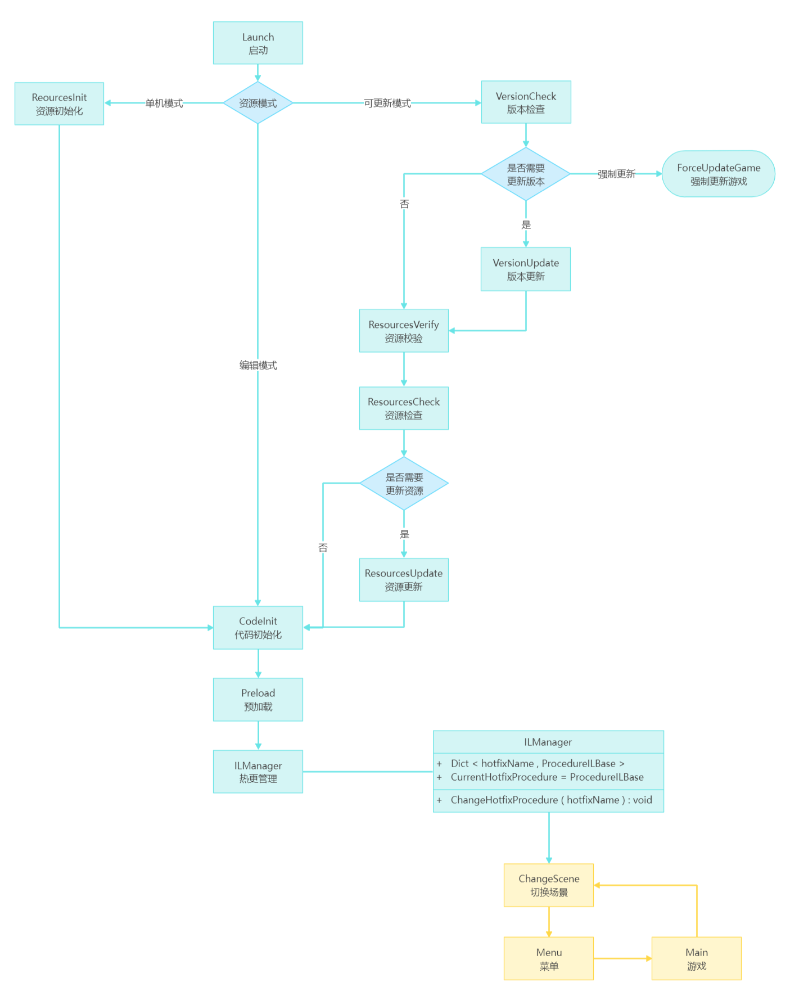

## 简介

使用 ILRuntime 对 StarForce 实现部分游戏逻辑热更新，包含 UI 模块、Entity 模块、Procedure 模块、Game 模块。下面简单介绍下各模块的热更实现。

> **UI：** ILRuntime 不推荐热更 MonoBehavior，所以热更层 HotfixForm 使用 ILUserData 和底层 ILForm 进行逻辑绑定，ILForm 逻辑继承自框架的 UIForm，可以实现使用 GameEntry.UI 操作 HotfixForm。ILForm 内部使用 ReferenceController 记录引用的组件，用于 HotfixForm 访问 UI 组件。
>
> **Entity：** 和 UI 模块类似，热更层 HotfixEntity 底层 ILEntity 和使用 ILUserData 进行逻辑绑定，ILEntity 逻辑继承自框架的 Entity，可以实现使用 GameEntry.Entity 操作 HotfixEntity。
>
> **Procedure：** 流程模块不使用 MonoBehavior，不受 ILRuntime 的限制，但受 GameFramework 的限制：FsmManager 内部不支持动态增删 FsmState，ProcedureManager 继承自 FsmManager，也不支持增删 ProcedureBase。即使支持动态增删，仍然会有另一个问题：GameFramework 的 FsmManager 中使用的 Dictionary 存储的 FsmState（ FsmState 的类型和名称组合作为 Key，FsmState 的对象作为 Value ），ProcedureManager 作为 FsmManager 的子类，也是这样存储的。但是 ILRuntime 中的类使用跨域继承时，类型 Type 返回的是类的适配器 TypeAdapter，所以在热更代码中使用继承会造成字典的 key 重复，所以要在热更层操作流程，不能直接继承自 ProcedureBase。我的实现方式是：底层创建热更流程管理器 ProcedureILManager 这一流程，内部使用字典实现简单的子流程管理，内部绑定底层的可热更流程基类 ProcedureILBase 和热更层的 HotfixProcedure，实现热更流程的 Fsm 切换。
>
> **Game：** 游戏模块是纯逻辑类，与 GameFramework 底层没有交互，可以直接跨域继承实现逻辑热更。

演示视频 - [bilibili](https://www.bilibili.com/video/BV1wB4y1Q7JK) （使用 HuaTuo 进行的热更新，测试打包流程是一样的）

## 相关链接

**GameFramework** - [https://gameframework.cn/](https://gameframework.cn/)

**ILRuntime** - [https://ourpalm.github.io/ILRuntime/public/v1/guide/index.html](https://ourpalm.github.io/ILRuntime/public/v1/guide/index.html)